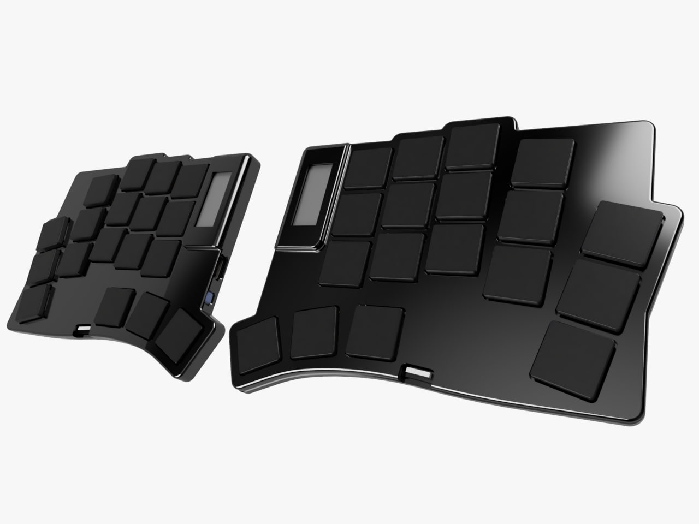

# Wafer Split Keyboard

    
    
*Ultra-thin. Ultra-comfortable. Ultra-productive.*

## Overview

Wafer is a cutting-edge split mechanical keyboard designed for those who demand both elegance and functionality. With its remarkably thin profile, it redefines what's possible in ergonomic keyboard design.

### ✨ Key Features

- **Ultra-thin Profile**: Engineered for maximum comfort with minimal desk footprint
- **Split Design**: Independent halves for optimal ergonomic positioning
- **Wireless Freedom**: Bluetooth connectivity for a clean, cable-free setup
- **ZMK Firmware**: Powered by modern, wireless-first ZMK firmware
- **Long Battery Life**: Month of battery life design for extended use
- **Memory-in-pixel Display**: Built-in display for battery, connectivity, and layer status, `and Raw HID functions (to be implemented)`

Double tap the power button to open a bootloader, flash both halves with the compiled firmware

Pair your keyboard and enjoy the typing experience!

## Technical Specifications

- **Controller**: ARM-based microcontroller [ISP1807], based on nrf52840
- **Connectivity**: Bluetooth LE & USB-C
- **Features**:
  - Custom status display `(nice!view compatible, custom UI in development)`
  - Advanced power management

## License

This project is released under the [MIT License](LICENSE).

---

Made with ❤️ by the Oleksandr Maslov

